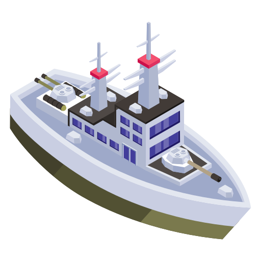

# Sea-Ping Warfare

<p align="center">
  
</p>

> A thrilling 2D top-down battleship combat game inspired by Wii Play: Tanks! Navigate treacherous waters, master ricochet physics, and outmaneuver enemy fleets in this action-packed naval warfare experience.

[](https://python.org)
[](https://pygame.org)
[](LICENSE)

## Gameplay

<p align="center">
  
</p>

**Sea-Ping Warfare** puts you in command of a powerful battleship in a strategic naval combat arena. Your mission: eliminate all enemy vessels using tactical ricochet shots while avoiding their deadly cannon fire.

### Key Features
- **Precise Aiming System** - Smooth 360° turret rotation with keyboard controls
- **Physics-Based Ricochets** - Master the art of bouncing cannonballs off obstacles
- **Strategic Naval Combat** - Use cover and positioning to outmaneuver enemies
- **Health System** - Players have 3 health points with visual health bars
- **Score Tracking** - Compete for high scores and perfect victories

### Game Mechanics
- **Movement**: Navigate with WASD keys for precise ship control
- **Aiming**: Use arrow keys for smooth turret rotation
- **Firing**: Spacebar launches cannonballs that bounce up to 2 times
- **Strategy**: Use obstacles and walls for ricochet shots to hit enemies around corners

## Gameplay Video

[](https://youtu.be/8MdT8eYzP9Y)

## Quick Start

### Prerequisites
- Python 3.7 or higher
- pip (Python package installer)

### Installation

1. **Clone the repository**
   ```bash
   git clone https://github.com/yourusername/sea-ping-warfare.git
   cd sea-ping-warfare
   ```

2. **Install dependencies**
   ```bash
   pip install -r requirements.txt
   ```

3. **Launch the game**
   ```bash
   python main.py
   ```

### Alternative Installation
If you prefer using a virtual environment:
```bash
python -m venv venv
source venv/bin/activate  # On Windows: venv\Scripts\activate
pip install -r requirements.txt
python main.py
```

## Controls

| Action | Key |
|--------|-----|
| **Move Ship** | `W` (Up), `A` (Left), `S` (Down), `D` (Right) |
| **Aim Turret** | `↑` (Up), `←` (Left), `↓` (Down), `→` (Right) |
| **Fire Cannonball** | `Spacebar` |
| **Restart Game** | `R` |

## How to Play

### Objective
Destroy all enemy ships before they eliminate you. Use strategic positioning and ricochet shots to overcome numerical disadvantages.

### Strategy Tips
- **Use Cover**: Position yourself behind obstacles to avoid enemy fire
- **Master Ricochets**: Bounce shots off walls to hit enemies around corners
- **Stay Mobile**: Keep moving to make yourself a harder target
- **Plan Your Shots**: Cannonballs are limited - make each one count
- **Watch Your Corners**: Enemies can also use ricochet tactics

### Scoring
- **+1 Point** for each enemy ship destroyed
- **Victory** when all enemies are eliminated
- **Game Over** if your ship is hit by enemy fire

## Technical Details

### Built With
- **Python 3.7+** - Core programming language
- **Pygame 2.0+** - Game development framework
- **Math Module** - Physics calculations for ricochet mechanics

### Project Structure
```
sea-ping-warfare/
├── main.py              # Entry point, game loop
├── game/
│   ├── entities/        # Game objects (Player, Enemy, Cannonball)
│   ├── levels/          # Level management and data
│   ├── physics/         # Collision detection and physics
│   └── ui/              # HUD and user interface
├── config/              # Game settings and constants
└── utils/               # Helper functions and utilities
```

### Architecture
- **Modular Design** - Clean separation of concerns across multiple modules
- **Object-Oriented Design** - Well-structured game entities
- **Event-Driven Game Loop** - Responsive input handling
- **Collision Detection** - Precise hit detection and physics
- **State Management** - Smooth game flow and restart functionality

### Performance
- **60 FPS** target frame rate for smooth gameplay
- **Optimized collision detection** for responsive ricochet physics
- **Memory-efficient** object management

## Game Features

### Visual Design
- **Clean, minimalist graphics** for focus on gameplay
- **Color-coded cannonballs** (Blue = Player, Orange = Enemy)
- **Smooth animations** for turret rotation and movement
- **Real-time UI** showing score and controls

### Audio (Future Enhancement)
- Sound effects for firing, ricochets, and explosions
- Background music for immersive gameplay
- Audio feedback for hits and misses

## Customization

### Easy Modifications
The game is designed for easy customization:

```python
# Adjust game difficulty
ENEMY_FIRE_INTERVAL = 180  # Enemy firing speed
CANNONBALL_BOUNCES = 2     # Maximum ricochets
MAX_CANNONBALLS = 2        # Active projectile limit

# Modify gameplay feel
PLAYER_SPEED = 3.0         # Ship movement speed
CANNONBALL_SPEED = 8.0     # Projectile velocity
```

### Adding New Features
- **New enemy types** with different behaviors
- **Power-ups** and special weapons
- **Multiple levels** with varying difficulty
- **Multiplayer support** for competitive play

## Contributing

We welcome contributions! Here's how you can help:

1. **Fork the repository**
2. **Create a feature branch** (`git checkout -b feature/amazing-feature`)
3. **Commit your changes** (`git commit -m 'Add amazing feature'`)
4. **Push to the branch** (`git push origin feature/amazing-feature`)
5. **Open a Pull Request**

### Development Setup
```bash
git clone https://github.com/yourusername/sea-ping-warfare.git
cd sea-ping-warfare
pip install -r requirements.txt
# Make your changes and test with: python main.py
```

## License

This project is licensed under the MIT License - see the [LICENSE](LICENSE) file for details.

## Acknowledgments

- **Wii Play: Tanks** - Original inspiration for the ricochet mechanics
- **Pygame Community** - Excellent documentation and examples
- **Python Community** - Robust ecosystem for game development

## Support
- **Email**: Contact me at jacobsonjackson3@gmail.com

---

**Ready to command the seas? Download Sea-Ping Warfare today and prove your naval supremacy!**

*Made with passion by a developer who loves strategic combat games.* 